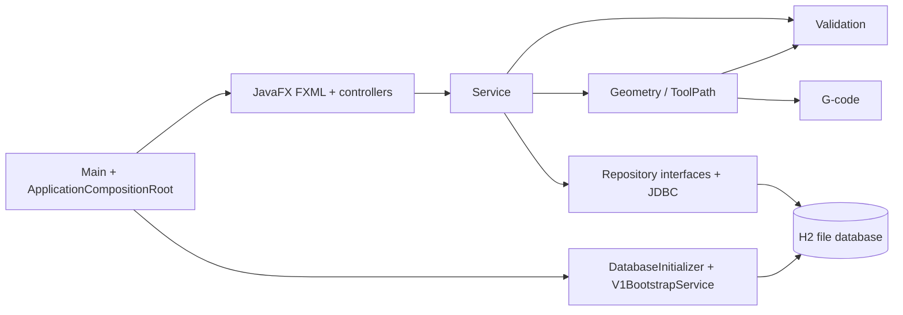

# Audit podloga — arhitektura aplikacije

> Status dokumenta: **IMPLEMENTIRANO** stanje utvrđeno pregledom izvornog koda i resursa. Testni razred postoji, ali cijeli skup nije pokrenut u ovom auditu jer naredba `mvn test` nije dostupna u okruženju (`mvn` nije prepoznat). Zato se u ovom dokumentu ne tvrdi da je nešto **TESTIRANO** samo na temelju postojanja testa.

## 1. Stvarna struktura i arhitekturni stil

Aplikacija je nemodularna Java 26 / JavaFX desktop aplikacija s ručno sastavljenim, **slojevitim arhitekturnim stilom**. Sloj JavaFX prikaza koristi controllere, pa postoje elementi nalik MVC-u (FXML je prikaz, controller reagira na UI događaje), ali implementacija nije čisti klasični MVC: domenski modeli nisu zasebni MVC modeli za pojedine prikaze, controlleri ne dobivaju ovisnosti od frameworka, a poslovno orkestriranje i persistence su izdvojeni u service i JDBC slojeve.  
Dokaz: `pom.xml`; `src/main/java/hr/lukabosnjak/app/ApplicationCompositionRoot.java — ApplicationCompositionRoot#createController`.

| Paket | Status | Stvarna odgovornost |
|---|---|---|
| `app` | **IMPLEMENTIRANO** | Pokretanje JavaFX-a, navigacija i ručno composition/wiring mjesto. |
| `config` | **IMPLEMENTIRANO** | H2 URL i inicijalizacija sheme/migracija. |
| `domain.entities` | **IMPLEMENTIRANO** | Promjenjivi domenski modeli: korisnik, kataloški podaci, snapshotovi i nalog. |
| `domain.enums` | **IMPLEMENTIRANO** | `ShapeType` i `ShapeSubtype`. |
| `domain.model` | **NIJE IMPLEMENTIRANO** | Takav paket ne postoji; modeli su u `domain.entities`. |
| `validation` | **IMPLEMENTIRANO** | Poslovna, ulazna i geometrijska validacija bez JavaFX/JDBC ovisnosti. |
| `geometry` | **IMPLEMENTIRANO** | Točke, segmenti, ToolPath, oblici, translacija, kompenzacija i granice. |
| `layout` | **ITERACIJA 2 / NIJE IMPLEMENTIRANO** | Paket i algoritam raspoređivanja nisu prisutni. Aplikacija generira putanju za jedan element. |
| `gcode` | **IMPLEMENTIRANO** | Pretvorba pripremljenog ToolPatha u G-code, profil/envelope, format i izvoz. |
| `service` | **IMPLEMENTIRANO** | Orkestriranje generiranja, autentikacija/RBAC, sesija, katalog, spremljeni programi i export granica. |
| `service.dto` | **NIJE IMPLEMENTIRANO** | Takav paket ne postoji; `ProgramGenerationRequest` je record izravno u `service`. |
| `persistence.repository` | **IMPLEMENTIRANO** | Apstraktna repository sučelja s CRUD/read operacijama. |
| `persistence.jdbc` | **IMPLEMENTIRANO** | JDBC implementacije, mapiranje i transakcijsko spremanje naloga. |
| `ui.controller` | **IMPLEMENTIRANO** | JavaFX controlleri, parsiranje brojčanog teksta i sučelje navigacije. |

## 2. Pokretanje, inicijalizacija i wiring

`Main` proširuje `javafx.application.Application`. U `Main#init` poziva `ApplicationCompositionRoot#initializeDatabase`, a u `Main#start` postavlja naslov, učitava prijavu i prikazuje primarni Stage. `showLogin`, `showRegistration`, `showMain`, `showSavedPrograms`, `showCatalog` i `showUserManagement` učitavaju odgovarajući FXML. Pristup glavnom, katalogu i spremljenim programima provjerava autentikaciju; upravljanje korisnicima provjerava `MANAGE_USERS`.  
Dokaz: `src/main/java/hr/lukabosnjak/app/Main.java — Main#init`, `Main#start`, `Main#showView` i `Main#showMainWithJob`.

`ApplicationCompositionRoot` je jedino mjesto ručnog dependency wiringa. Metoda `production` predaje `DatabaseConfig::getConnection`; konstruktor zatim stvara JDBC repozitorije, validatore, geometry i G-code objekte, servise te zajednički `SessionContext`. `createController` ručno bira konstruktor za svaki podržani controller i predaje mu potrebne servise i `ApplicationNavigation`. `FXMLLoader#setControllerFactory` koristi taj factory pri učitavanju prikaza. Ne postoji Spring, CDI, Guice ni drugi dependency-injection framework.  
Dokaz: `src/main/java/hr/lukabosnjak/app/ApplicationCompositionRoot.java — ApplicationCompositionRoot#ApplicationCompositionRoot`, `#production`, `#initializeDatabase`, `#createController`; `Main#showView`.

## 3. JavaFX/FXML sloj

Postoji devet stvarnih prikaza i svaki deklarira odgovarajući controller:

| FXML | Controller | Odgovornost i ovisnosti |
|---|---|---|
| `login.fxml` | `LoginController` | Prijava preko `AuthService`, brisanje lozinke i navigacija. |
| `registration.fxml` | `RegistrationController` | Usporedba unesenih lozinki, registracija/prijava preko `AuthService`, navigacija. |
| `main-form.fxml` | `MainFormController` | Glavni obrazac: učitavanje referentnih podataka, parsiranje unosa, poziv generiranja, save/export, brzi pristup spremljenima i dijalozi kataloga. Koristi `ProgramGenerationService`, oba reference-data servisa, preset, saved/export/auth/session/authorization servise. |
| `saved-programs.fxml` | `SavedProgramsController` | Popis, prikaz G-koda, otvaranje i export spremljenih programa; koristi `SavedJobService`, `ProgramExportService`, `SessionContext`. |
| `catalog.fxml` | `CatalogController` | Pregled i uređivanje kataloga, aktiviranje/deaktiviranje te pregled/export spremljenih programa; koristi management, saved/export, authorization i session servis. |
| `user-management.fxml` | `UserManagementController` | Popis korisnika, promjena role i aktivnog statusa preko `UserManagementService`. |
| `material-type-form.fxml` | `MaterialTypeFormController` | Parsira tekstualna polja i stvara/ažurira `MaterialType` kroz management servis. |
| `cnc-machine-form.fxml` | `CncMachineFormController` | UI parsiranje brojeva i stroj kroz management servis. |
| `tool-form.fxml` | `ToolFormController` | UI parsiranje broja alata/dimenzija i alat kroz management servis. |

Dokaz: `src/main/resources/hr/lukabosnjak/ui/view/*.fxml`; `src/test/java/hr/lukabosnjak/ui/controller/FxmlControllerContractTest.java — FxmlControllerContractTest#fxmlResourcesReferenceExistingControllerFieldsAndActions`.

Controlleri ne izvode SQL, ne računaju ToolPath/geometriju i ne generiraju G-code naredbe. Ipak, `MainFormController` je funkcionalno velik: drži dinamička polja oblika, kreira domenske objekte iz UI unosa, upravlja dijalozima, stanjem previewa i poziva više različitih servisa. To je ograničenje čistoće i veličine UI koordinacije, a ne dokaz da se poslovna logika nalazi u controlleru.  
Dokaz: `src/main/java/hr/lukabosnjak/ui/controller/MainFormController.java — MainFormController#handleGenerate`, `#handleSave`, `#handleExport`, `#readGenerationRequest`; `NumericInputParser`.

### Parsiranje nasuprot validaciji

`NumericInputParser` pripada UI sloju: pretvara tekst, prihvaća decimalni zarez i odbacuje prazne/nebrojčane/ne-konačne vrijednosti. Form controlleri ga koriste prije stvaranja domenskog objekta. `ShapeValidator`, `MaterialSheetValidator`, `MachiningParametersValidator`, `MachiningJobValidator` i `ReferenceDataValidator` pripadaju reusable domenskoj/poslovnoj validaciji. `SingleShapeFitValidator` zasebno provjerava geometrijski XY opseg nakon kompenzacije prema dimenzijama ploče i radnom području stroja.  
Dokaz: `src/main/java/hr/lukabosnjak/ui/controller/NumericInputParser.java`; `src/main/java/hr/lukabosnjak/validation/*.java`.

## 4. Service sloj

| Servis | Stvarna odgovornost |
|---|---|
| `ProgramGenerationService` | Orkestrira generiranje jednog elementa bez persistencea i layouta. |
| `ReferenceDataService` / `MaterialReferenceDataService` | Učitavaju aktivne strojeve/alate odnosno nedeaktivirane vrste materijala za generator. |
| `ReferenceDataManagementService` | RBAC-provjerena izrada, izmjena, aktiviranje/deaktiviranje i dohvat kataloga; normalizira tekst i primjenjuje `ReferenceDataValidator`. |
| `SavedJobService` | Spremanje, dohvat, popis i rekonstrukcija `GCodeProgram` iz spremljenog teksta. |
| `ProgramExportService` | Granica service sloja za export već generiranog programa. |
| `AuthService` / `PasswordHasher` | Registracija u roli `OPERATOR`, prijava, normalizacija usernamea i PBKDF2 hash/verifikacija. |
| `SessionContext` | In-memory trenutno prijavljeni korisnik za jedan proces aplikacije. |
| `AuthorizationService` | RBAC dozvole: `ADMIN` upravlja korisnicima; `ADMIN`/`ENGINEER` katalogom; sve tri role mogu generirati. |
| `UserManagementService` | RBAC upravljanje korisnicima; štiti vlastiti račun i posljednjeg aktivnog administratora. |
| `V1BootstrapService` | Idempotentno osigurava role, testne materijale, ZK-1325 zapis, softverske testne alate i razvojne korisnike. |
| `MachiningParametersPreset` | Samo referentne softverske početne vrijednosti; nije fizička potvrda postavki stroja. |

Dokaz: `src/main/java/hr/lukabosnjak/service/*.java`, posebno `AuthService#register`, `#login`; `AuthorizationService#require`; `V1BootstrapService#initialize`.

### Stvarni slijed generiranja

`ProgramGenerationService#generate` prima `ProgramGenerationRequest` s odabranim strojem, alatom, pločom, parametrima, oblikom i `CutSide`. Iz zahtjeva sastavlja privremeni `MachiningJob` naziva `Preview`, količine 1 i bez G-koda te poziva `MachiningJobValidator`. Nakon toga slijedi:

`ProgramGenerationRequest` → `MachiningJobValidator` → `ToolPathService#generate(Shape)` → `ToolPathCompensationService#compensate(..., Tool, CutSide)` → `SingleShapeFitValidator#validate` → `GCodeGenerator#generate` → `GCodeProgram`.

Generator je u produkcijskom composition rootu `RichAutoA11GCodeGenerator`. Service ne sprema nalog, ne generira raspored više elemenata i ne računa layout.  
Dokaz: `src/main/java/hr/lukabosnjak/service/ProgramGenerationService.java — ProgramGenerationService#generate`; `ApplicationCompositionRoot#ApplicationCompositionRoot`; `src/test/java/hr/lukabosnjak/service/ProgramGenerationServiceTest.java — ProgramGenerationServiceTest#validatesGeneratesFitsAndDelegatesOneToolPath` (**NIJE TESTIRANO u ovom auditu**).

## 5. Domain i geometry/ToolPath

Glavni domenski modeli su `Role`, `User`, `MaterialType`, `CncMachine`, `Tool`, `MaterialSheet`, `MachiningParameters`, `Shape` i agregat `MachiningJob`. `MaterialSheet`, `MachiningParameters` i `Shape` služe kao snapshotovi pri spremanju naloga; katalog strojeva, alata, materijala i korisnika ostaje referenciran preko FK-a. `ShapeType` ima `SQUARE`, `RECTANGLE`, `CIRCLE`, `TRIANGLE`, a `ShapeSubtype` podržava jednakostranični trokut. Modeli nisu JavaFX ni JDBC objekti.  
Dokaz: `src/main/java/hr/lukabosnjak/domain/entities/*.java`; `src/main/java/hr/lukabosnjak/domain/enums/*.java`; `JdbcMachiningJobRepository#save`.

`ToolPath` je nepromjenjivi record s barem jednim `PathSegment`om, početnom točkom i `translated` operacijom. `PathSegment` je sealed sučelje za `LineSegment` i `ArcSegment`; luk čuva početak, kraj, središte i `ArcDirection`. `ToolPathService` sve konture postavlja s polazištem u XY ishodištu: kvadrat je pravokutnik s jednakim stranicama, pravokutnik ima četiri linije, jednakostranični trokut tri linije, a krug je zatvorena kontura od dva CCW polukruga između lijeve i desne točke.  
Dokaz: `src/main/java/hr/lukabosnjak/geometry/ToolPath.java`; `PathSegment.java`; `LineSegment.java`; `ArcSegment.java`; `ToolPathService#generate`.

`CutSide` ima samo `INSIDE` i `OUTSIDE`. `ToolPathCompensationService` računa putanju središta alata geometrijskim offsetom za polumjer odabranog alata: linijske konture offsetira i siječe susjedne offset-linije, a čistu kružnu konturu radijalno širi/smanjuje. Miješane line/arc konture nisu podržane. `ToolPathBoundsCalculator` uključuje krajnje točke i kardinalne ekstreme luka, a `SingleShapeFitValidator` zahtijeva granice unutar `[0, širina] × [0, visina]` ploče i stroja.  
Dokaz: `ToolPathCompensationService#compensate`; `ToolPathBoundsCalculator#calculate`; `SingleShapeFitValidator#validate`; testovi `ToolPathCompensationServiceTest`, `ToolPathBoundsCalculatorTest`, `ToolPathTranslationTest` (**NIJE TESTIRANO u ovom auditu**).

## 6. G-code sloj

`GCodeGenerator` prihvaća pripremljen `ToolPath` i `MachiningParameters`. `RichAutoA11GCodeGenerator` provjerava povezanu zatvorenu putanju, `PassDepthCalculator` izračunava pozitivne dubine prolaza, `RichAutoA11ProgramEnvelope` dodaje zaglavlje/završetak, a `GCodeFormatter` formatira brojeve. Za reference profil zaglavlje uključuje `G21`, `G17`, `G90`, `G54` i `M03`; profil ne emitira S brzinu, ali emitira posmake. Linije postaju `G01`, lukovi `G02`/`G03` s I/J relativnim prema početku luka. `NcExportService` zahtijeva `.nc`, US-ASCII i koristi `CREATE_NEW`, pa ne prepisuje postojeću datoteku.  
Dokaz: `src/main/java/hr/lukabosnjak/gcode/RichAutoA11GCodeGenerator.java — #generate`; `RichAutoA11Profile#referenceProgramProfile`; `RichAutoA11ProgramEnvelope#headerLines`; `NcExportService#export`.

Kompenzacija se izvodi prije generatora u `ToolPathCompensationService`; generator ne emitira `G41`/`G42`. Generator namjerno ne odabire alat, ne računa raspored, ne provjerava fizičku konfiguraciju stroja niti jamči kompatibilnost sa svim CNC kontrolerima. Profil `physicallyConfirmedCapabilities` za reference profil je prazan. RichAuto A11 izlaz je **IMPLEMENTIRANO**, ali fizička provjera na ZK-1325/RichAuto A11 je **NIJE TESTIRANO** u ovom auditu.  
Dokaz: `ProgramGenerationService#generate`; `RichAutoA11Profile#referenceProgramProfile`; `RichAutoA11GCodeGeneratorTest`, `ReferenceRectangleAuditTest` (**NIJE TESTIRANO u ovom auditu**).

## 7. Persistence sloj

Repository sučelja odvajaju service sloj od JDBC-a. `Jdbc*Repository` implementacije dobivaju `ConnectionProvider`, koriste `PreparedStatement` i mapiraju retke u domenske objekte. `DatabaseInitializer` stvara `schema.sql` samo kada nema tablica, provjerava očekivani skup od devet tablica te potom izvršava tri migracije. `V1BootstrapService` se poziva nakon inicijalizacije. `JdbcMachiningJobRepository` sam upravlja transakcijom za snapshotove i glavni nalog; detaljni model je u dokumentu 05.  
Dokaz: `src/main/java/hr/lukabosnjak/persistence/repository/*.java`; `persistence/jdbc/*.java`; `config/DatabaseInitializer.java — #initialize`; `JdbcMachiningJobRepository#save`.

## 8. Tokovi kroz arhitekturu

### Tok A — pokretanje i prijava

`Main#main` → JavaFX `Main#init` → `ApplicationCompositionRoot#initializeDatabase` → `DatabaseInitializer#initialize` → `V1BootstrapService#initialize` → `Main#start` → `Main#showLogin` → `login.fxml` / factory `LoginController` → `LoginController#handleLogin` → `AuthService#login` → `JdbcUserRepository#findByUsername` → `PasswordHasher#verify` → `SessionContext#login` → `ApplicationNavigation#showMain` → `Main#showMain` → `main-form.fxml` / `MainFormController`.

### Tok B — generiranje jednog programa

Korisnik unosi polja u `main-form.fxml` → `MainFormController#readGenerationRequest` koristi `NumericInputParser` i stvara domenske objekte → `MainFormController#handleGenerate` → `ProgramGenerationService#generate` → validatori → `ToolPathService` → `ToolPathCompensationService` → `SingleShapeFitValidator` → `RichAutoA11GCodeGenerator#generate` → `GCodeProgram` → `MainFormController` prikazuje `GCodeProgram#text`.

### Tok C — spremanje i ponovno otvaranje

`MainFormController#handleSave` uzima već prikazani program i stvara `MachiningJob` s prijavljenim korisnikom → `SavedJobService#save` → `JdbcMachiningJobRepository#save` → transakcijski insert `MATERIAL_SHEET`, `MACHINING_PARAMETERS`, `SHAPE`, `MACHINING_JOB` → commit → `MainFormController#refreshSavedJobs`. Kasnije `SavedProgramsController#handleOpen` ili `MainFormController#handleOpenSavedJob` → `SavedJobService#loadById` → `JdbcMachiningJobRepository#findById` i potpuno join-mapanje → `Main#showMainWithJob` / `MainFormController#loadSavedJob` → popunjeni obrazac i spremljeni G-code.

## 9. Ograničenja arhitekture

- **ITERACIJA 2 / NIJE IMPLEMENTIRANO:** nema `layout` paketa ni algoritma za količine/optimizirani raspored; generiranje i UI poruke odnose se na jedan element.
- Dodavanje oblika zahtijeva promjene u `ShapeType`, `ShapeValidator`, `ToolPathService`, UI dinamičkim poljima i testovima; nije plug-in proširenje.
- Postoji samo jedna konkretna produkcijska G-code implementacija u ručnom wiringu; odabir generatora nije konfigurabilni plug-in mehanizam.
- Ručni composition root je pregledan, ali povećava broj konstrukcijskih ovisnosti, posebno kod `MainFormController`.
- Nema DI frameworka niti fizičkog machine-test dokaza. Konfiguracijske/reference vrijednosti nisu dokaz trajne fizičke postavke stroja.

## Specifikacija dijagrama za završni rad

Novi dijagram treba biti jednostavan slojeviti dijagram, bez pojedinačnih klasa i bez SQL stupaca.

- Lijevo postaviti blok **JavaFX UI**: devet FXML prikaza, controllere i `NumericInputParser`.
- Iznad/uz UI postaviti **App / Composition root** s `Main`, `ApplicationCompositionRoot` i strelicom factory/wiring prema controllerima i servisima.
- Iza UI-a postaviti **Service**: generiranje, autentikacija/sesija/RBAC, reference data, spremljeni programi i export.
- Ispod Servicea postaviti paralelne blokove **Validation**, **Domain**, **Geometry / ToolPath** i **G-code**. Strelica generiranja ide Service → Validation → Geometry/ToolPath → Validation (fit) → G-code → UI preview/export.
- Desno postaviti **Persistence (repository + JDBC + ConnectionProvider)**, sa strelicama Service → repository sučelja → JDBC. Iza njega, izvan aplikacijskih slojeva, postaviti **H2 file database**.
- Prikazati `DatabaseInitializer` i `V1BootstrapService` uz composition root/persistence s inicijalizacijskom strelicom prema H2.
- Ne prikazivati MVC oznaku, nepostojeći layout, algoritam optimizacije, fizički stroj kao testirano odredište ni sve metode/entitete.

